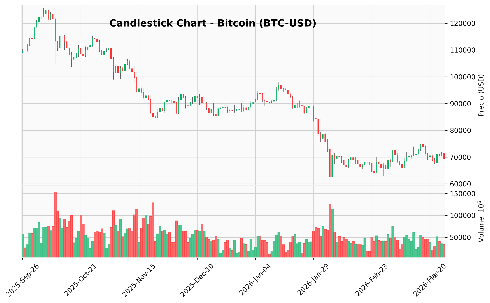
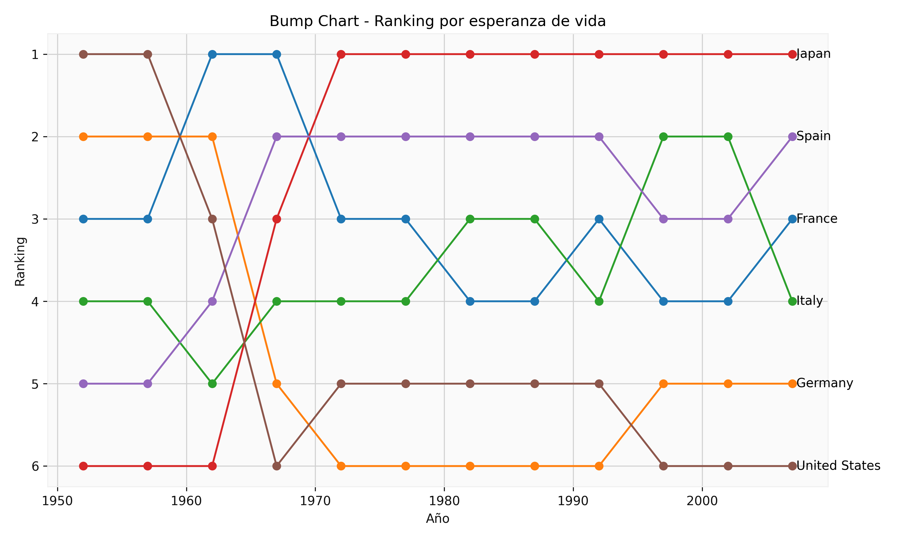

# PEC2_Visualización

## Histograma Iris

Visualización de la distribución de la variable sepal_length del dataset Iris.

## Candlestick Bitcoin

Visualización del precio de Bitcoin mediante velas (candlestick), incluyendo apertura, cierre, máximo, mínimo y volumen.

## Bump Chart

Visualización de la evolución del ranking de países en función de la esperanza de vida.

